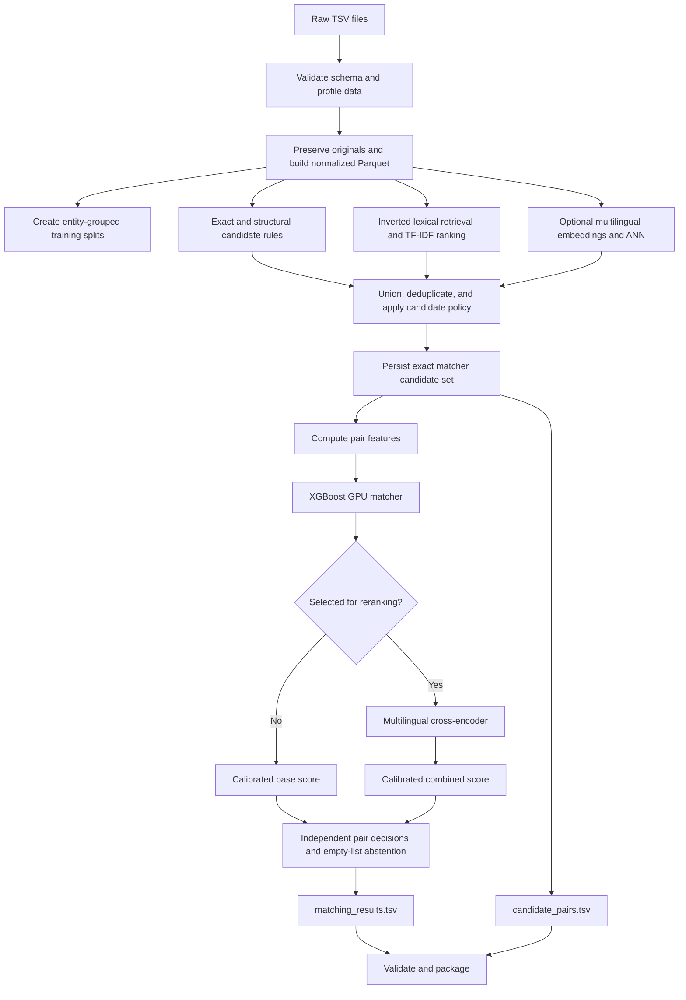

# Implementation Plan: GPU Business Entity Resolution for the Amazon ML Challenge

## 1. Objective and Delivery Rules

Build a reproducible pipeline that reads the supplied business records, learns from training labels, and produces:

- `matching_results.tsv`: final matches for every test Source 1 entity.
- `candidate_pairs.tsv`: the exact candidate set presented to the matching pipeline.
- A runnable submission package with pinned dependencies, saved model configuration, evaluation results, and completed methodology documentation.

Follow the architecture in the two supplied research PDFs, with `PS.pdf` governing challenge rules.

The total budget is **24 hours, including implementation, setup, experiments, inference, and packaging**. Prioritize a complete validated submission. Implement the full modular workflow, but activate expensive neural stages only when measured runtime and validation results justify them. Document any implemented stages that were not run at full scale.

Use the existing `bash run_qwen.sh` environment. Qwen is the environment and the proposed embedding model; a generative Qwen matching model is not required.

The coding agent should save this plan as project documentation and maintain a checklist of implemented, tested, executed, and deferred stages. Leave the existing `AGENTS.md` unchanged.

## 2. Verified Starting Point

### 2.1 Repository and Environment

The current implementation has preprocessing, candidate generation, and metric utilities. The main pipeline entry point is empty.

Important findings:

- `TfidfBlocker` currently uses CPU `HashingVectorizer`, without IDF weighting.
- Its nested query/corpus scans are memory bounded but still perform excessive work at this dataset size.
- Current normalization removes non-ASCII characters, which can destroy useful multilingual information.
- The macro F0.5 implementation incorrectly awards `1.0` when precision and recall are both zero.
- The Docker environment mounts the dataset directory read-only, including the currently configured output location.
- Existing exploratory changes and artifacts belong to the user and must be preserved.

Observed environment:

| Resource | Observed State |
|---|---|
| GPU | NVIDIA RTX PRO 4000 Blackwell, 24,467 MiB |
| Available GPU memory during inspection | Approximately 20 GiB |
| Host memory | Approximately 31 GiB; other applications consume a substantial portion |
| Available disk after cleanup | Approximately 93 GiB |
| Python | 3.10.12 |
| PyTorch | 2.12.1+cu130; CUDA available |
| Transformers | 5.17.0 |
| cuDF | 26.2.1 |
| Missing packages | cuML, cuVS, XGBoost, sentence-transformers, RapidFuzz |

These are observations, not permanent assumptions. Preflight must check them again.

### 2.2 Dataset Scale

Counts below exclude headers and should be confirmed by the validated parser:

| Split | Source 1 | Source 2 | Source 3 |
|---|---:|---:|---:|
| Train | 2,206,821 | 5,034,616 | 5,285,603 |
| Test | 1,732,544 | 4,887,273 | 5,082,316 |

Training ground truth contains:

- 7,638,365 positive pairs.
- 123,247 Source 1 entities with no matches.
- 119,157 with one match.
- 1,964,417 with multiple matches.
- A maximum of 11 matches for an entity.

France contributes 259,452 test Source 1 records and is absent from training.

Consequently, exhaustive comparisons, forced top-one matching, and terminating retrieval after the first match are unsuitable.

## 3. Pipeline Architecture



All candidate pairs pass through the base matcher. Deterministic rules supply candidates and features rather than bypassing the audited candidate path.

The cross-encoder scores a subset of those candidates. Its subset does not replace the full `candidate_pairs.tsv`.

## 4. Execution Interfaces and Artifact Contracts

### 4.1 Entry Point

Implement a single orchestrator at `business_entity_resolution/run_pipeline.py`, backed by modules under `src/`.

Expose these stages:

| Stage | Responsibility |
|---|---|
| `preflight` | Check environment, dependencies, resources, and paths |
| `profile` | Validate and summarize raw data and labels |
| `prepare` | Normalize records and persist reusable shards |
| `split` | Create reproducible entity-grouped splits |
| `candidates` | Build and evaluate candidate sets |
| `features` | Materialize bounded training feature shards |
| `train` | Fit base matcher and optional neural components |
| `calibrate` | Fit score calibration and decision thresholds |
| `evaluate` | Produce retrieval and matching reports |
| `predict` | Run the selected configuration over all test entities |
| `validate` | Check output completeness, IDs, and candidate inclusion |
| `package` | Assemble the final submission |

Example intended interface:

```bash
bash run_qwen.sh

python3 business_entity_resolution/run_pipeline.py \
  --config business_entity_resolution/configs/base.yaml \
  --stage preflight

python3 business_entity_resolution/run_pipeline.py \
  --config business_entity_resolution/configs/base.yaml \
  --stage train \
  --resume

python3 business_entity_resolution/run_pipeline.py \
  --config business_entity_resolution/configs/final.yaml \
  --stage predict \
  --mode test \
  --resume
```

The orchestrator must resolve prerequisite stages, validate their manifests, and reuse compatible results. A missing trained model must produce an actionable error rather than trigger unplanned training during test prediction.

### 4.2 Configuration

Use a typed configuration with these sections:

- **Paths:** raw dataset, artifacts, models, output, temporary files.
- **Resources:** GPU, host-memory budget, disk reserve, worker count.
- **Data:** parser settings, normalization version, split seed.
- **Retrieval:** enabled branches, posting limits, top-K, candidate limits.
- **Models:** revisions, feature schema, training parameters.
- **Decision policy:** calibration, thresholds, reranking gate.
- **Execution:** deadline, resume behavior, stage budgets.

Default generated files to a writable `artifacts/` directory under the project, outside `challenge-dataset/`.

Reject configurations that place output under the read-only dataset mount.

### 4.3 Internal Records

Use stable integer row IDs internally while preserving original entity IDs in lookup tables.

Persist:

- **Normalized records:** source, split, country, original fields, normalized fields, row ID.
- **Candidates:** query row ID, target source and row ID, retrieval provenance, branch scores and ranks.
- **Features:** candidate identity, versioned numeric columns, optional training label.
- **Predictions:** candidate identity, base score, reranker score when present, final score, decision.

Candidate identity is unique within a split. Missing branch scores are explicit missing values with presence flags.

Use Parquet shards, not large Python dictionaries or CSV feature matrices.

### 4.4 Restartability

Each stage writes a manifest containing input fingerprints, configuration hash, code revision and dirty-diff fingerprint, schema version, dependency versions, row counts, completed shards, timing, and quality checks.

Write shards to temporary names and atomically rename on completion. Resume only when dependencies and configuration match.

## 5. Phase A: Environment and Correctness Foundations

### 5.1 Dependency Setup

Preserve the working PyTorch/CUDA environment. Do not copy the research PDFs’ version recommendations blindly or upgrade the host driver as part of this task.

Resolve additional packages against Python 3.10 and the installed CUDA stack:

- Compatible cuML/cuVS packages from the same RAPIDS release family as cuDF.
- XGBoost.
- RapidFuzz.
- A YAML parser and pytest.
- sentence-transformers only if the chosen neural wrapper requires it; direct Transformers APIs are acceptable.

Perform a dependency resolution preview, then GPU smoke tests before locking exact versions. RAPIDS compatibility depends on Python, CUDA, and package versions; follow the [official RAPIDS installation guidance](https://docs.rapids.ai/install/).

If optional RAPIDS retrieval packages cannot be installed within 45 minutes, retain GPU cuDF and XGBoost and use the bounded CPU lexical implementation. Record the fallback.

### 5.2 Resource Policy

Default limits:

- GPU allocation budget: the smaller of 18 GiB or current free memory minus 2 GiB.
- Host working-memory budget: the smaller of 10 GiB or 60% of currently available memory.
- Minimum free disk reserve: 20 GiB.
- CPU preprocessing workers: 2 initially.
- GPU owner: one active process at a time.
- Initial record batch: 100,000 rows, reduced when expansion exceeds the budget.

Before each expensive stage, estimate disk and memory from a representative sample. Reject or reduce a stage before it exhausts resources.

Do not stop unrelated containers or applications automatically.

### 5.3 Correct Scoring Before Experiments

For each Source 1 entity, calculate:

```text
F0.5 = 1.25 × TP / (1.25 × TP + FP + 0.25 × FN)
```

Handle the empty case explicitly:

- Empty truth and empty prediction: `1.0`.
- Empty truth with any prediction: `0.0`.
- Nonempty truth with no correct prediction: `0.0`.

Average over the authoritative evaluation Source 1 universe. Treat missing and unexpected prediction rows as validation failures; do not silently alter the averaging population.

Reject duplicate ground-truth rows instead of overwriting them.

## 6. Phase B: Data Profiling and Normalization

### 6.1 Profiling

Read TSV fields explicitly as strings, preserving literal values such as `"NA"` and empty fields. Confirm quoting behavior against actual data before fixing parser settings.

Validate:

- Required columns and expected source prefixes.
- Unique entity IDs within each source.
- Ground-truth references and Source 1 coverage.
- Malformed records and unexpected fields.
- Country values and missingness.
- Whether any target belongs to multiple Source 1 entities.
- Whether true pairs have different country labels.

Produce counts and distributions for names, addresses, token counts, lengths, Unicode scripts, exact and normalized duplicates, name/address collision frequency, match multiplicity and singleton prevalence, and agreement of positive pairs under each normalization and blocking rule.

Existing analysis outputs may be reused only after their input fingerprints and completeness are verified.

### 6.2 Normalization Views

Preserve original text permanently. Create:

| View | Purpose |
|---|---|
| NFKC and casefold | Unicode-aware comparison |
| Conservative canonical name | Punctuation, spaces, common legal-form variants |
| Accent-folded name | Additional lexical retrieval |
| Suffix-stripped name | Recall-oriented retrieval |
| Sorted name tokens | Word-order variation |
| Transliterated name | Cross-script retrieval |
| Canonical address | Address comparison |
| Address digit tokens | Numeric evidence |
| Postal-like tokens | Additional structural evidence |
| Script and missingness flags | Model features |

Use standard Unicode handling on CPU where necessary and cache the result. Use cuDF for bulk supported string transformations and joins.

Do not remove all non-Latin characters. Do not remove address numbers. Keep accent-preserving and accent-folded forms separately. Treat blank strings as missing evidence; two empty names or addresses must not create an exact-match block.

Country remains an open string. No fixed `{US, India}` encoding or filtering is allowed.

Store compact normalized shards. Derive bulky token and n-gram representations only when needed.

## 7. Phase C: Leakage-Resistant Development Splits

Create connected groups of Source 1 entities linked by shared positive target IDs. Assign an entire group to one split.

Use seed `42` and approximately 70% training, 10% model development, 10% calibration and policy selection, and 10% final internal audit. Balance country and match-count categories where possible. Persist assignments before model fitting.

For the one-day run, use deterministic representative subsets:

- Up to 150,000 training Source 1 entities.
- Up to 20,000 development entities.
- Up to 20,000 calibration entities.
- Up to 20,000 audit entities.

Search these queries against the full training target pools. A small sampled target pool would underestimate retrieval difficulty.

Use labels only from the appropriate split. Test records may define their own unlabeled search indexes, but must never influence supervised fitting or threshold selection.

Add a bounded leave-one-country-out diagnostic using US and India. Treat this as a robustness check, not an estimate of performance on France.

Keep the audit split sealed until the final configuration is selected.

## 8. Phase D: Scalable Candidate Generation

### 8.1 Exact and Structural Branches

Generate candidates through conservative name equality; canonical name plus address evidence; name plus matching numeric address tokens; accent-folded or transliterated name with supporting evidence; and rare name-token and address-token blocks.

Attach rule identity, collision counts, and source to every pair. Search both Source 2 and Source 3 even after finding a confident match. Do not impose target exclusivity or one-to-one assignment.

### 8.2 Lexical Branch

Replace the current repeated whole-corpus scans with a partitioned inverted index.

Initial policy:

1. Build target document-frequency statistics by source and dynamic country.
2. Index distinctive name tokens and character trigrams.
3. For each query, use up to four rare tokens and six rare trigrams with document frequency at most 2,000.
4. Add address-number/name-prefix blocks.
5. Union posting hits and rank by IDF-weighted overlap.
6. Retain up to 1,000 preliminary hits per target source.
7. Compute character 3–5 gram TF-IDF cosine on those pairs.
8. Keep the selected lexical top-K per source.

Start with top-K `25`; evaluate `10`, `25`, and `50`.

Build and process posting partitions incrementally. Fit source-specific TF-IDF statistics once, persist them, and reuse identical feature semantics for queries and targets.

The posting stage is itself a recall-limiting block. Measure recall before and after it; do not describe its results as unrestricted global TF-IDF nearest neighbors.

If posting recall is poor, expand to ten rare tokens/trigrams and document frequency 5,000 on the development sample. Select the smallest configuration meeting the quality/runtime gate.

For tiny fixtures, retain an exhaustive reference implementation to verify ranking correctness.

### 8.3 Country Handling

Use country for efficient primary partitions. Include a global rare-key fallback for missing countries and strong name/address keys.

If profiling discovers cross-country positives, evaluate and enable a broader cross-country branch. Report its recall separately rather than silently excluding those labels.

### 8.4 Candidate Union and Limits

Deduplicate by pair identity while retaining all branch provenance.

Initial limits:

- Up to 50 lexical candidates per target source after tuning.
- Up to 25 dense candidates per target source when enabled.
- Overall starting cap: 100 candidates per Source 1 entity.

Reserve branch coverage when applying the cap. Preserve strong exact name-plus-address candidates. Rank remaining candidates with reciprocal-rank fusion, using a fixed fusion constant of `60`, and break ties by stable target ID.

Evaluate caps of `50`, `100`, and `150`. Log every truncation and measure positives lost to caps.

### 8.5 Retrieval Acceptance

Report pair candidate recall, per-entity recall on non-singletons, all-true-match coverage on non-singletons, average and p95 candidate count, recall by country/source/multiplicity/missing fields, each branch’s marginal contribution, and estimated full-run runtime and storage.

Aim for at least 99% pair candidate recall. This is an engineering target, not a promised result. If missed, preserve the measured best configuration and explain the failure categories.

## 9. Phase E: Pair Features and XGBoost

### 9.1 Feature Families

Build approximately 40–60 numeric features:

- Name equality across normalization views.
- Character TF-IDF cosine and n-gram overlap.
- Token Jaccard and token containment.
- Edit similarity and token-sort similarity.
- Name lengths, length ratio, and token-count differences.
- Legal-form agreement and conflict.
- Address equality, token overlap, and character similarity.
- Numeric-token agreement and disagreement.
- Postal-like-token agreement.
- Missingness and script compatibility.
- Target source.
- Country equality without country-specific one-hot encoding.
- Name/address frequency and block size.
- Retrieval branch flags, scores, ranks, and branch agreement.
- Dense cosine when the dense branch is enabled.

Distinguish unavailable values from genuine zero similarity. Use GPU operations where supported. Batch CPU RapidFuzz work over already blocked pairs; never use it over a Cartesian product.

### 9.2 Training Pairs

Use retrieved positives and hard negatives from the production candidate generator.

For each sampled training entity, keep all retrieved positives, up to 12 highest-ranked negatives, and up to four additional deterministic random candidate negatives. Include singleton entities. Normalize training weights so high-candidate entities do not dominate.

Report missed positive pairs separately. Never insert ground-truth positives into validation candidates.

Start with a two-million-pair training budget, then expand only if memory and time allow.

### 9.3 Base Model

Initial configuration:

```yaml
objective: binary:logistic
tree_method: hist
device: cuda
max_depth: 6
learning_rate: 0.05
n_estimators: 600
subsample: 0.85
colsample_bytree: 0.85
min_child_weight: 2
max_bin: 128
early_stopping_rounds: 50
```

Use development data for early stopping. Permit one additional depth-8 experiment if the baseline completes on schedule.

CUDA histogram training and quantile matrices are supported by [XGBoost's GPU interface](https://xgboost.readthedocs.io/en/stable/gpu/).

Save the feature schema, model, training sample manifest, and best iteration together.

## 10. Phase F: Multilingual Dense Retrieval

Implement this stage even if the deadline prevents full-scale activation.

### 10.1 Model and Representation

Use `Qwen/Qwen3-Embedding-0.6B` initially. Its official [model card](https://huggingface.co/Qwen/Qwen3-Embedding-0.6B) specifies Apache-2.0 licensing, multilingual support, and configurable embedding dimensions.

Defaults:

- Name-only representation first.
- 512-dimensional normalized embeddings.
- BF16 inference and FP16 persisted vectors.
- Maximum length 64 tokens for names.
- Query instruction describing retrieval of records for the same business.
- Target text without the query instruction.
- Correct last-token pooling and padding behavior from the model’s implementation.

Benchmark batches `32`, `64`, and `128`; select by sustained throughput and memory.

Implement a second name-plus-address view with maximum length 128, but leave it disabled unless it adds measurable recall and fits the deadline and disk budget.

### 10.2 Index

Partition by split, target source, and dynamic country. Build cuVS CAGRA indexes in shards of at most 500,000 target records.

Search all applicable shards and merge their results into a global per-source top-K. Do not retain K candidates independently from every shard.

Measure ANN recall against exact search over a small representative subset.

Release the embedding model before index construction/search. Process one index shard at a time.

### 10.3 Promotion Gate

Before full embedding generation:

1. Measure actual unique-text count and tokenizer throughput.
2. Benchmark representative short, long, multilingual, and missing-field records.
3. Forecast encoding, index, query, and storage costs with a 30% time margin.
4. Verify incremental recall on development queries against a representative target index.
5. Require the complete selected pipeline to fit the remaining deadline.

A dense configuration is promoted only after end-to-end validation shows improved macro F0.5, or equivalent quality with a meaningful runtime benefit.

Use a separate trained matcher artifact for each candidate/feature configuration. Do not add a dense branch at test time to a matcher trained only on lexical candidates.

## 11. Phase G: Hard-Negative Fine-Tuning and Selective Reranking

Use `BAAI/bge-reranker-v2-m3` as the initial cross-encoder. Its official [model card](https://huggingface.co/BAAI/bge-reranker-v2-m3) identifies it as multilingual and Apache-2.0 licensed.

### 11.1 Pair Input

Serialize each side consistently:

```text
Business name: ...
Business address: ...
Country: ...
```

Use original Unicode text with normalized spacing. Set maximum pair length to 256 tokens and record truncation frequency.

Treat pretrained reranker output as a relevance score, not an already calibrated probability of business identity.

### 11.2 Fine-Tuning

Implement a bounded supervised training path:

- Real positive pairs from the training split.
- Hard negatives from retrieval and base-model mistakes.
- Maximum 100,000 pairs.
- One epoch or 60 minutes, whichever occurs first.
- BF16, gradient accumulation, and checkpointing as required.
- Binary matching loss with balanced batches.
- Development-based checkpoint selection.

The one-day plan prioritizes fine-tuning the reranker over fine-tuning the retriever, because changing the retriever would require rebuilding the large embedding corpus.

### 11.3 Reranking Gate

Select candidates near the base decision threshold:

- Evaluate uncertainty widths of `0.05` and `0.10`.
- Rank eligible pairs by distance to the threshold.
- Allow at most three reranked pairs per Source 1 entity.
- Impose a full-run reranking budget derived from measured pairs/second, capped at two hours.

Pairs outside the reranking budget retain their calibrated base score. They are not discarded.

Fit a small score combiner using base margin, reranker score, and selected contradiction features. Calibrate it on held-out data.

Promote reranking only when the complete gated policy improves development macro F0.5 and fits the deadline. If fine-tuning or reranking fails its gate, use the saved base matcher.

## 12. Calibration, Decisions, and Evaluation

Split calibration entities into two deterministic halves:

- First half: probability calibration and reranker score combination.
- Second half: threshold and gate selection.

Use sigmoid calibration initially. Tune the final global threshold directly for entity-macro F0.5, including empty predictions. Start with a `0.01` grid and refine around the best region using `0.001` steps. For tied scores, prefer the higher threshold.

Each candidate receives an independent decision. Retain every candidate above its applicable threshold. If none pass, output an empty list.

Do not infer that two high-scoring candidates are mutually exclusive. Do not enforce one match per source.

Report macro F0.5, pair precision/recall, singleton accuracy and false-match rate, non-singleton and multi-match metrics, source performance, country/script slices, retrieval versus classification failures, runtime, peak GPU memory, host memory, and storage.

Evaluate the sealed audit split once after selecting the final policy. Do not retune against audit results.

Keep the calibrated trained model for submission. Avoid a last-minute refit on calibration/audit data that invalidates its thresholds.

## 13. Full Inference, Validation, and Packaging

### 13.1 Streaming Inference

Run all test Source 1 entities through the frozen configuration.

For each query shard:

1. Generate and finalize candidates.
2. Persist their identities and provenance.
3. Build features in bounded batches.
4. Score using the selected matcher.
5. Apply optional reranking and calibration.
6. Write candidate and matching output shards.
7. Record completion and counts.

Do not persist the entire test feature matrix. Persist candidates and scores sufficient for audit and resume.

### 13.2 Output Contract

Both files must use literal tab separators and the exact required headers; include every test Source 1 entity exactly once; represent no candidates or no matches with an empty second field; contain only existing Source 2/3 IDs; contain no duplicate IDs; and use deterministic ordering.

Required headers:

```text
matching_results.tsv:
source1_entity_id<TAB>matched_entity_ids

candidate_pairs.tsv:
source1_entity_id<TAB>candidate_entity_ids
```

Assert that every predicted match occurs in the corresponding candidate list. Treat violations as errors even if the supplied validator only warns.

### 13.3 Validation

Run the supplied validator against both final files.

Also implement a partitioned ID-membership and subset check, because loading all target IDs and candidate lists into Python sets may exceed available host memory.

Confirm the expected 1,732,544 output rows against the parsed test Source 1 count.

### 13.4 Package

Produce the challenge archive containing:

```text
<team_name>_submission.zip
├── output/
│   ├── matching_results.tsv
│   └── candidate_pairs.tsv
├── code/
│   └── business_entity_resolution/
│       ├── src/
│       ├── configs/
│       ├── models/
│       ├── run_pipeline.py
│       ├── README.md
│       └── requirements.txt
└── Documentation_template.md
```

Include the selected trained artifacts or an exact reproducible acquisition/training procedure with model revisions and checksums.

Fill the methodology with actual measurements, including disabled stages and known limitations.

Use a configurable team name, defaulting to `team_submission`. Do not invent member information.

## 14. Required Tests and Acceptance Criteria

### 14.1 Correctness Tests

Cover:

- Perfect, incorrect, partial, singleton, and empty predictions.
- Duplicate IDs, unexpected rows, and missing Source 1 entities.
- Accented French text, Indian scripts, punctuation, and missing fields.
- Empty strings never becoming broad exact blocks.
- Address numbers preserved.
- Multiple correct matches retained.
- Candidate deduplication and provenance merging.
- Cross-shard top-K merging.
- Stable row-ID mapping after sorting and partitioning.
- Training/validation group isolation.
- Candidate/feature/model schema mismatch rejection.
- Interrupted-stage resume and stale-cache invalidation.
- Disk and memory budget checks.

### 14.2 Integration Fixture

Create a small synthetic dataset with all three sources, singletons, multiple matches, near-duplicate negatives, accented names, missing addresses, and an unseen country.

Run preparation through packaging on CPU reference mode, then compare applicable GPU transformations and rankings within numerical tolerance.

### 14.3 Scale Gates

Run a representative 10,000-query benchmark against realistic target partitions before any full inference.

The final deliverable must satisfy:

- Both submission files validate.
- Complete Source 1 coverage.
- No illegal or unknown target IDs.
- Matches are a subset of recorded candidates.
- Correct macro F0.5 implementation.
- Reproducible model/configuration selection.
- Measured runtime and resource use.
- No external business lookup or enrichment.
- MIT/Apache-2.0 neural checkpoints within the challenge’s parameter limit.

A quality target that is missed must be reported accurately; it must not be substituted with an invented score.

## 15. Twenty-Four-Hour Delivery Schedule

These are work budgets, not measured runtime promises.

| Elapsed Time | Required Outcome |
|---|---|
| Hours 0–2 | Environment checks, metric fix, fixtures, configuration, manifests |
| Hours 2–5 | Profiling, normalization, split generation, lexical retrieval |
| Hours 5–9 | Candidate evaluation, features, XGBoost, calibration |
| Hours 9–12 | Working baseline submission path and full-run ETA |
| Hours 12–15 | Bounded dense/reranker experiments and promotion decisions |
| Hours 15–22 | Full inference using the best completed configuration |
| Hours 22–24 | Final validation, documentation, packaging, contingency |

Recalculate the schedule after every benchmark. Reserve:

```text
Required remaining time =
    1.3 × estimated remaining inference time
    + 2 hours for validation and packaging
```

Stop optional experiments whenever that reserve would be violated. Start full baseline inference earlier if its forecast requires it.

DALI, GPUDirect Storage, distributed execution, large-model comparisons, and exhaustive hyperparameter sweeps are deferred beyond this delivery. The PDFs position these as later optimizations. The immediate implementation should establish correctness, candidate recall, and a complete submission within the available resources.
